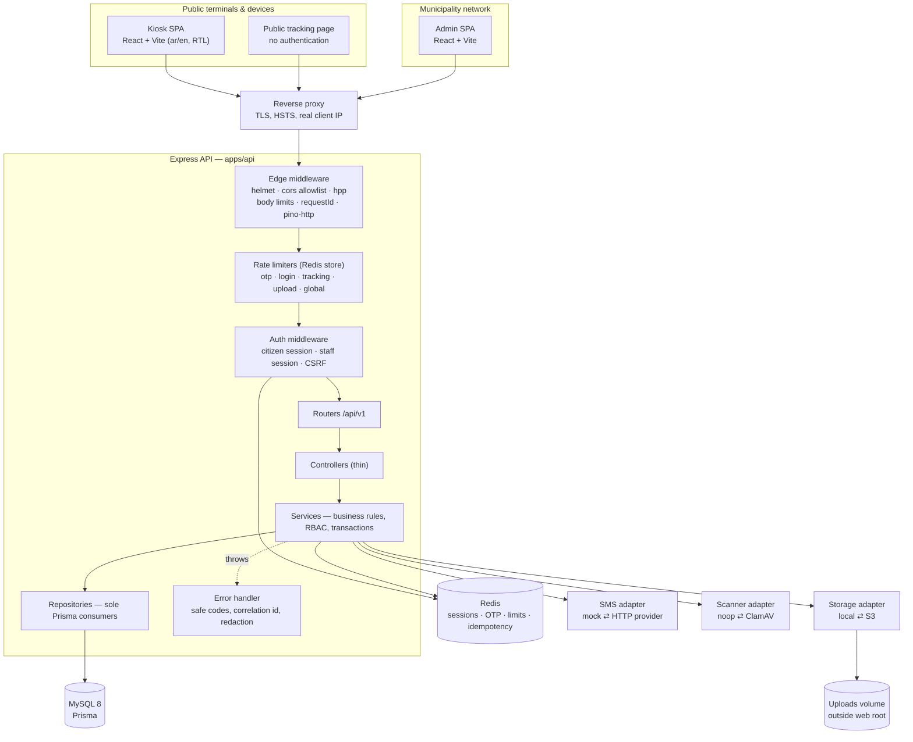
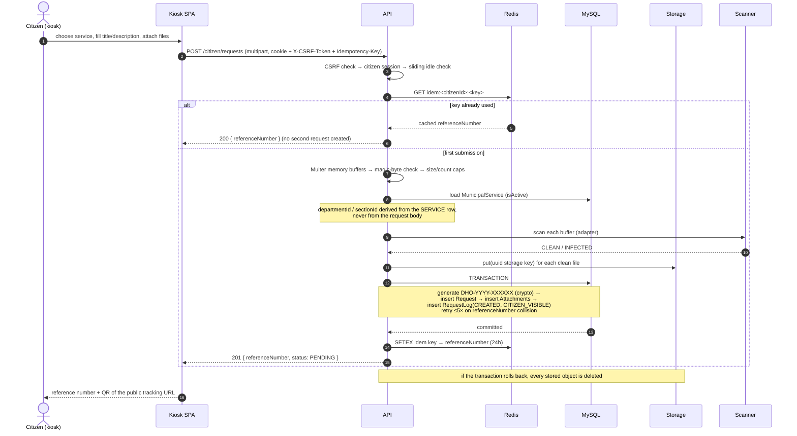
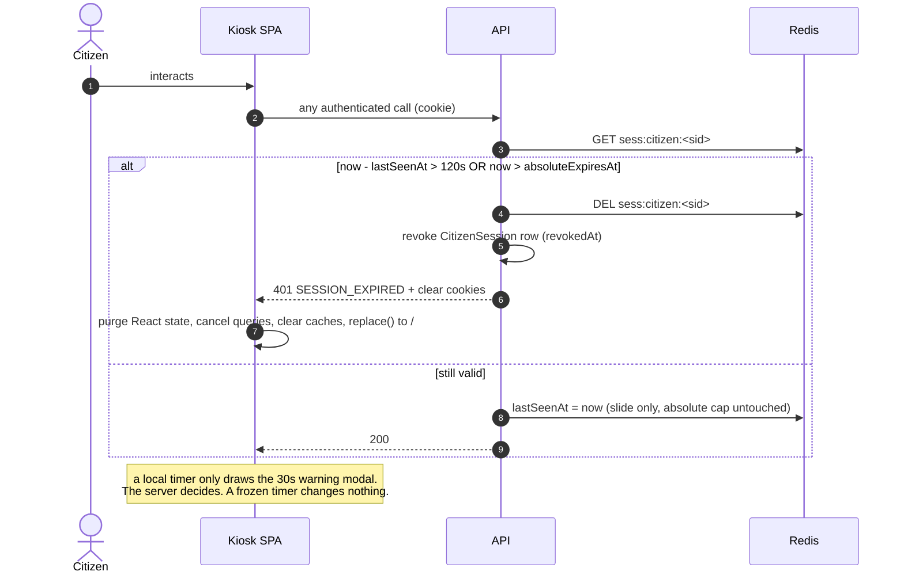

# 02 — High-Level Architecture

## Layers

```
Kiosk browser (React/Vite)  ─┐
Staff browser (React/Vite)  ─┤──► Reverse proxy (TLS) ──► Express API ──► Prisma ──► MySQL 8
Public tracking (no auth)   ─┘                              │
                                                            ├──► Redis (sessions, OTP, rate limits, idempotency)
                                                            ├──► Storage adapter (local FS | S3-compatible)
                                                            ├──► SMS adapter (mock | HTTP provider)
                                                            └──► Scanner adapter (noop | ClamAV)
```

The API is the only component that talks to a datastore. Both React apps are static
bundles; they hold **no** secrets and **no** tokens — every credential lives in an
`HttpOnly` cookie the JavaScript cannot read.

## Backend module anatomy

Every feature module is the same five files, so authorisation can never be "forgotten in
one place":

```
modules/<feature>/
  <feature>.routes.js       Express wiring only: middleware chain + controller reference
  <feature>.controller.js   HTTP in / HTTP out. No business rules, no Prisma.
  <feature>.service.js      Business rules, transactions, authorisation decisions.
  <feature>.repository.js   The only file allowed to touch `prisma`.
  <feature>.schemas.js      Zod schemas for params / query / body.
```

Rule: **inside `src/modules`, the Prisma client is imported only by
`*.repository.js`.** Controllers never import a repository, and no service in a
feature module touches Prisma.

Three files outside `src/modules` also use the client directly, deliberately:

| File | Why |
|---|---|
| `auth/citizenSession.js`, `auth/staffSession.js` | Session storage is infrastructure, not a feature. Routing it through a feature repository would make every module depend on the auth module. |
| `auth/requireCitizen.js`, `auth/requireStaff.js` | Load the actor on each request, before any module is reached. |
| `utils/audit.js` | The audit writer must work even for identifiers that belong to no module — a failed login against a username that does not exist. |

Verify with:

```bash
grep -rln "infra/prisma" apps/api/src/modules
```

which should list only `*.repository.js` files plus `health.service.js` (that one
imports the `pingDatabase` health helper, not the client).

## Authorisation is applied twice, deliberately

1. **Route layer** — `requireStaff(...roles)` rejects a caller whose role could never
   perform the operation. Cheap, coarse, fails before any query.
2. **Service layer** — `assertCanViewRequest`, `assertCanUpdateStatus`,
   `assertCanAssign` re-derive the decision *from the loaded row* (its
   `departmentId` / `sectionId` / `assignedTo`) against the caller's scope.

Step 2 is the real control. Step 1 exists so that a bug in step 1 is not a breach and a
bug in step 2 is not reachable by an obviously-wrong role. The frontend hides buttons
purely for ergonomics; it is never consulted.

## Architecture diagram



## Request-submission flow



## Citizen idle-expiry flow


