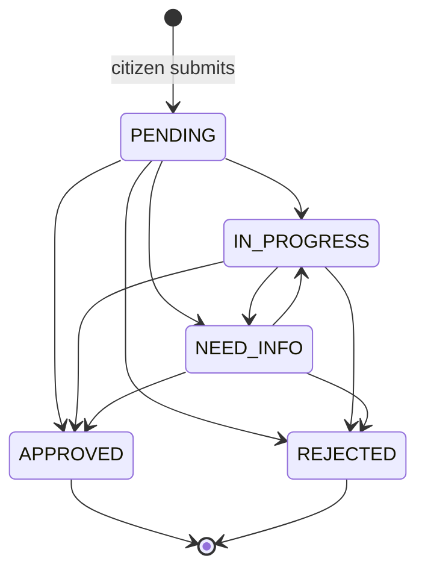

# 04 — Request Status Transition Matrix

## Matrix

| From \ To | PENDING | IN_PROGRESS | NEED_INFO | APPROVED | REJECTED |
|---|---|---|---|---|---|
| **PENDING** | — | ✓ | ✓ | ✓ | ✓ |
| **IN_PROGRESS** | ✗ | — | ✓ | ✓ | ✓ |
| **NEED_INFO** | ✗ | ✓ | — | ✓ | ✓ |
| **APPROVED** | ✗ | ✗ | ✗ | — (terminal) | ✗ |
| **REJECTED** | ✗ | ✗ | ✗ | ✗ | — (terminal) |

Encoded once, in `packages/shared/src/statuses.js`, as `STATUS_TRANSITIONS`. The API,
the tests and both SPAs read that single object; no status string is duplicated.

## Rules attached to a transition

1. A same-value transition (`X → X`) is rejected `INVALID_STATUS_TRANSITION`.
2. A transition out of `APPROVED`/`REJECTED` is rejected `REQUEST_IS_TERMINAL`.
3. The caller must pass `assertCanUpdateStatus` (see `docs/03-rbac.md`).
4. `newStatus`, `previousStatus`, the actor and an optional note are written to a
   `RequestLog` **inside the same Prisma transaction** as the `Request.status` update.
   A failure to write the log rolls the status change back.
5. Moving to `NEED_INFO` requires a `CITIZEN_VISIBLE` note (the citizen must be told
   what is missing). Enforced by Zod (`superRefine`) and re-checked in the service.
6. A citizen reply is only accepted while the status is `NEED_INFO`; it writes a
   `CITIZEN_REPLIED` log and leaves the status unchanged. Staff decide when to move it
   back to `IN_PROGRESS`.

## Public (coarsened) status labels

| Internal | Public label | ar | en |
|---|---|---|---|
| `PENDING` | `RECEIVED` | تم الاستلام | Received |
| `IN_PROGRESS` | `UNDER_REVIEW` | قيد المعالجة | Under review |
| `NEED_INFO` | `ACTION_REQUIRED` | بحاجة إلى إجراء | Action required |
| `APPROVED` | `CLOSED` | مغلق | Closed |
| `REJECTED` | `CLOSED` | مغلق | Closed |

`APPROVED` and `REJECTED` deliberately collapse to one public label so that an
enumerator cannot mine outcomes from reference numbers.

## Log actions

`CREATED`, `ASSIGNED`, `REASSIGNED`, `STATUS_CHANGED`, `INTERNAL_NOTE_ADDED`,
`CITIZEN_VISIBLE_NOTE_ADDED`, `CITIZEN_REPLIED`, `ATTACHMENT_ADDED`,
`ATTACHMENT_REJECTED`, `AUTO_ROUTED`.

Logs are append-only. There is no update or delete path for `RequestLog` anywhere in the
codebase — the repository exposes `create` and `findMany` only.
