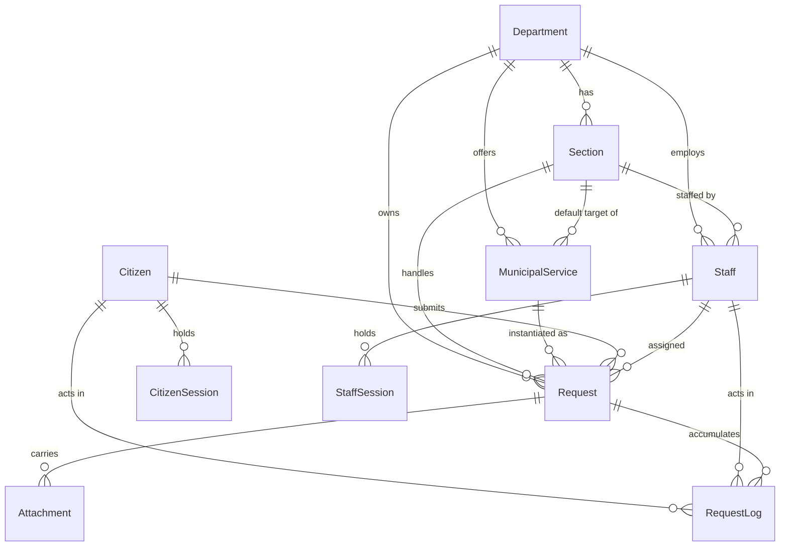

# 05 — Database Design

## Relationship map

## Why each relationship exists

- **Department → Section (1:N).** A section belongs to exactly one department
  (`Section.departmentId`, `onDelete: Restrict`). This single FK is what makes the
  "cross-section assignment" rule checkable in one comparison.
- **Department/Section → MunicipalService.** `sectionId` is nullable: a service may stop
  at the department (a manager triages it) or pre-route to a section. This is the *only*
  source of routing — the client's `departmentId`/`sectionId` are never read.
- **Request → Department + Section (denormalised).** The request stores its own
  `departmentId`/`sectionId` copied from the service at creation time. Without this, a
  later edit to a service would silently re-scope historical requests and change who can
  read them. Scope must be immutable history, not a live join.
- **Request → Staff (`assignedTo`, nullable, `onDelete: SetNull`).** Unassigned is a
  legitimate state (fresh `PENDING`). Staff are deactivated (`isActive=false`), not
  deleted; `SetNull` exists only as a last-resort safety net.
- **Request → Citizen (`Restrict`).** A citizen row can never be deleted while requests
  reference it — the municipal record must survive.
- **Attachment → Request (`Cascade`).** Attachment metadata has no meaning without its
  request. Deleting a request is not an application operation; cascade is a database
  hygiene rule, not a feature.
- **RequestLog → Request (`Cascade`), → Staff/Citizen (`SetNull`).** The log survives
  actor deactivation: `actorType` + the free-form `metadata` snapshot preserve who acted
  even if the FK is nulled.
- **OtpChallenge** has *no* FK to `Citizen` on purpose. An OTP may be requested for a
  phone number that has no citizen row yet, and creating a citizen row before
  verification would let an attacker enumerate/populate the citizen table.
- **AuthenticationAudit** references nothing with a FK. It must remain writable and
  readable even for failed logins against non-existent usernames, and it must not leak
  existence through a FK violation.

## Index strategy

| Table | Index | Query it serves |
|---|---|---|
| `Request` | `@@unique(referenceNumber)` | tracking + citizen detail lookups |
| `Request` | `@@unique([citizenId, idempotencyKey])` | duplicate-submission suppression |
| `Request` | `(status, createdAt)` | staff queue, default sort |
| `Request` | `(departmentId, status, createdAt)` | manager list + analytics |
| `Request` | `(sectionId, status, createdAt)` | section-head list + analytics |
| `Request` | `(assignedTo, status, createdAt)` | employee list |
| `Request` | `(citizenId, createdAt)` | citizen dashboard pagination |
| `Request` | `(serviceId)` | per-service reporting |
| `Citizen` | `@@unique(phoneNumber)` | OTP login |
| `Citizen` | `@@unique(civilIdHash)` | civil-ID dedupe without storing plaintext |
| `OtpChallenge` | `(phoneNumber, createdAt)` | latest active challenge |
| `OtpChallenge` | `(expiresAt)` | cleanup sweep |
| `Attachment` | `(requestId)` | detail page + the 5-file ceiling count |
| `RequestLog` | `(requestId, createdAt)` | timeline |
| `RequestLog` | `(requestId, visibility, createdAt)` | citizen-visible timeline (no post-filter) |
| `StaffSession` | `@@unique(tokenHash)`, `(staffId, revokedAt)` | refresh + bulk revoke |
| `CitizenSession` | `@@unique(tokenHash)`, `(citizenId, revokedAt)` | idle sweep + logout |
| `Staff` | `@@unique(username)`, `(departmentId, sectionId, isActive)` | assignee pickers |
| `Section` | `@@unique([departmentId, nameAr])`, `@@unique([departmentId, nameEn])` | no duplicate section names in a department |

## Rules Prisma cannot express

Prisma/MySQL cannot express "the assignee's department must equal the request's
department **and** the assignee's section must equal the request's section". That is a
cross-row invariant. It is enforced in `requests.service.js#assertValidAssignee`, inside
the same transaction that performs the assignment, and covered explicitly by
`tests/integration/assignment.test.js`.

Similarly, "a service's `sectionId` must belong to that service's `departmentId`" is
enforced in `catalog.service.js` and re-verified by the seed script.

## Time

All `DateTime` columns are `DATETIME(3)` in UTC — the Prisma datasource URL carries
`timezone=UTC` (see `.env.example`) and `process.env.TZ` is pinned to `UTC` in
`src/server.js`. Rendering to `Asia/Muscat` happens once, in
`packages/shared/src/time.js`, used by both SPAs.
